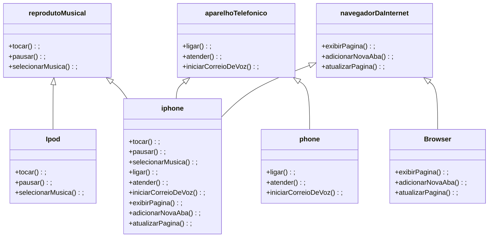

# UML-Iphone

## Diagrama de classes

```mermaid
classDiagram
class reprodutoMusical {
  +tocar();
  +pausar();
  +selecionarMusica();
}
class Ipod {
  +tocar();
  +pausar();
  +selecionarMusica();
}
reprodutoMusical<|--Ipod
class aparelhoTelefonico {
  +ligar();
  +atender();
  +iniciarCorreioDeVoz();
}
class phone {
  +ligar();
  +atender();
  +iniciarCorreioDeVoz();
}
aparelhoTelefonico<|--phone
class navegadorDaInternet {
  +exibirPagina();
  +adicionarNovaAba();
  +atualizarPagina();
}
class Browser {
  +exibirPagina();
  +adicionarNovaAba();
  +atualizarPagina();
}
class iphone {
  +tocar();
  +pausar();
  +selecionarMusica();
  +ligar();
  +atender();
  +iniciarCorreioDeVoz();
  +exibirPagina();
  +adicionarNovaAba();
  +atualizarPagina();
}
navegadorDaInternet<|--Browser
reprodutoMusical<|--iphone
aparelhoTelefonico<|--iphone
navegadorDaInternet<|--iphone
```
